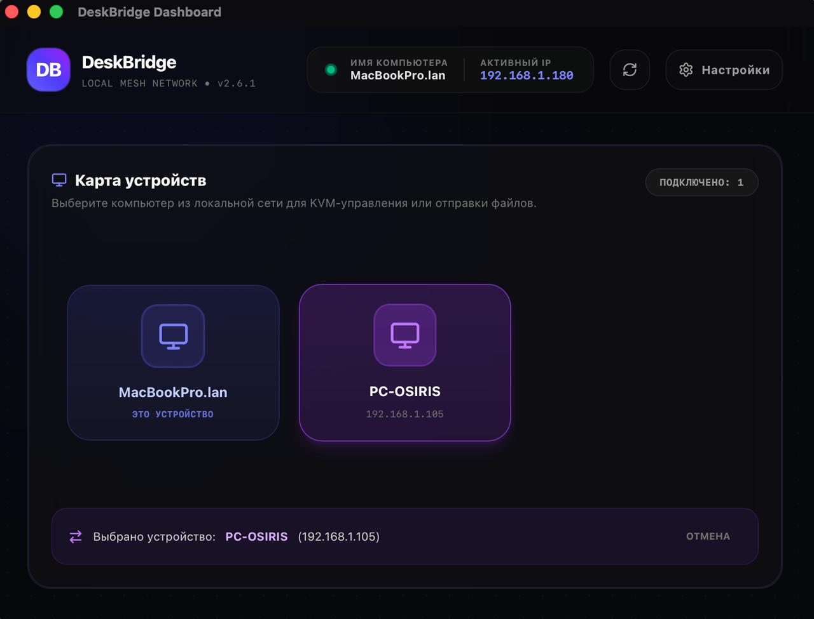

<div align="center">


# DeskBridge (v2.6.1)

**Беспроводной KVM-переключатель с общим буфером обмена и P2P-обменником файлов для локальной сети**

[](https://github.com/dmitrymx/deskbridge/releases)
[](https://tauri.app)
[](https://react.dev)
[](https://www.rust-lang.org)
[](#)
[](LICENSE)

*Свяжите ваши компьютеры в единую рабочую среду. Управляйте вторым ПК одной мышкой, просто переведя курсор за край экрана, синхронизируйте буфер обмена, обменивайтесь файлами на гигабитных скоростях и отправляйте фото с телефона через локальный веб-портал — без серверов, без интернета, без облаков.*

---

</div>

## ✨ Возможности / Features

- 🖥️ **Виртуальный KVM (Universal Control)** — бесшовный переход мыши и клавиатуры между несколькими ПК (включая связки Windows ↔ macOS) при касании границы экрана.
- 📋 **Общий буфер обмена (текст + файлы)** — синхронизация текста и файлов между машинами. Скопируйте файл → вставьте в папку на другом ПК (Ctrl+V / Cmd+V). Нативные форматы CF_HDROP и NSPasteboardTypeFileURL.
- ⌨️ **Настраиваемые горячие клавиши** — переопределяйте комбинации клавиш переключения (модификаторы Ctrl, Alt, Shift + клавиши A-Z, F1-F12).
- 🎚️ **Настройка скорости курсора и прокрутки** — ползунки для регулировки множителя скорости (1x–5x) для компенсации различий разрешения/DPI между экранами.
- 🚀 **Высокоскоростной P2P-обмен** — прямая передача файлов любого объема со скоростью до 1 Гбит/с (ограничена только роутером).
- 📂 **Кнопка «Открыть папку с файлом»** — быстрый доступ к папке загрузки после приёма файла.
- 📱 **Мобильный веб-портал** — отправляйте файлы со смартфонов iPhone/Android на ПК через браузер без установки приложений.
- 🛡️ **Контроль целостности SHA-256** — автоматический расчет контрольной суммы для гарантированной защиты от повреждения.
- 📝 **Логирование в один клик** — встроенный менеджер логов с копированием, сохранением и очисткой.
- 🔌 **Выбор сетевого интерфейса** — ручной выбор активного IP для исключения виртуальных адаптеров.
- 🔒 **100% Приватность и Offline** — никаких серверов, облаков, CDN. Полностью автономно.

---

## 📸 Скриншоты / Screenshots

<p align="center">
  
</p>


---

## 📋 Таблица сравнения версий

| Возможность | v1.0.0 | v2.2.0 | v2.5.0 | v2.6.1 (Текущая) |
| :--- | :---: | :---: | :---: | :---: |
| **Локальное P2P-копирование** | ❌ | ✅ | ✅ | ✅ |
| **Веб-портал для iOS/Android** | ❌ | ✅ | ✅ | ✅ |
| **Настраиваемые KVM-хоткеи** | ❌ | ✅ | ✅ | ✅ |
| **Встроенный сборщик логов** | ❌ | ✅ | ✅ | ✅ |
| **Barrier-style захват курсора** | ❌ | ❌ | ✅ | ✅ |
| **Батчинг дельт мыши (8KHz)** | ❌ | ❌ | ✅ | ✅ |
| **Корректный Release (type=6)** | ❌ | ❌ | ✅ | ✅ |
| **Кнопка «Открыть папку»** | ❌ | ❌ | ✅ | ✅ |
| **🆕 Общий буфер обмена (текст)** | ❌ | ❌ | ❌ | ✅ |
| **🆕 Общий буфер обмена (файлы)** | ❌ | ❌ | ❌ | ✅ |
| **🆕 Настройка скорости курсора** | ❌ | ❌ | ❌ | ✅ |
| **🆕 Настройка скорости прокрутки** | ❌ | ❌ | ❌ | ✅ |

---

## 🛠 Что нового в версии v2.6.1

*   **📋 Общий буфер обмена (текст):** Автоматическая синхронизация скопированного текста между ПК через KVM-соединение. Копируете текст на Windows → вставляете на Mac и наоборот.
*   **📂 Общий буфер обмена (файлы):** Скопируйте файл на одном ПК — вставьте в папку на другом (Ctrl+V / Cmd+V). Использует нативные форматы CF_HDROP (Windows) и NSPasteboardTypeFileURL (macOS) через библиотеку `clipboard-rs`. Файлы сохраняются в папку Загрузки.
*   **🎚️ Настройка скорости курсора:** Ползунок 1x–5x в настройках для компенсации разницы DPI/разрешения между Windows и Mac. По умолчанию 3.0x.
*   **🎚️ Настройка скорости прокрутки:** Отдельный ползунок 1x–5x для колёсика мыши. По умолчанию 3.0x.
*   **🔧 Barrier-style cursor warp:** Реализация по мотивам исходного кода Barrier (OSXScreen.mm) — warp-to-center + delta capture вместо ClipCursor.
*   **🔧 Корректное отключение KVM:** Хост отправляет явную команду ReleaseControl (type=6), клиент корректно обрабатывает.
*   **📂 Кнопка «Открыть папку»:** После завершения передачи файла можно открыть папку загрузки одним нажатием.

## 🛠 Что было в версии v2.5.x

*   **Barrier-style warp-to-center:** Замена ClipCursor(1x1) на подход из исходников Barrier — warp к центру + delta calculation.
*   **Hotkey switch back fix:** Явная отправка ReleaseControl + обработка type=6 на клиенте.
*   **Keyboard debug logging:** Логирование ошибок KeyPress/KeyRelease на клиенте для диагностики macOS Accessibility.

## 🛠 Что было в версии v2.4.0

*   **Батчинг дельт мыши для игровых мышей (2K-8K Hz):** Атомарное накопление дельт + отдельный поток-отправитель 120Hz.
*   **Нативный захват курсора:** Windows — ClipCursor, macOS — CGAssociateMouseAndMouseCursorPosition.
*   **Безопасный файловый диалог:** rfd крейт вместо tauri-plugin-dialog для предотвращения конфликтов с WH_MOUSE_LL хуком.

---

## 💻 Инструкция по сборке / Build Guide

### 📋 Предварительные требования (Prerequisites)

#### Для Windows 11:
1.  Установленный [Node.js](https://nodejs.org/) (версии 18+).
2.  Установленный Rust-компилятор (`rustup` / `cargo`).
3.  Компилятор C++ (Visual Studio Build Tools с включенным пакетом «Разработка классических приложений на C++»).

#### Для macOS:
1.  Установленный [Node.js](https://nodejs.org/) (рекомендуется через Homebrew).
2.  Установленный Rust:
    ```bash
    curl --proto '=https' --tlsv1.2 -sSf https://sh.rustup.rs | sh
    ```
3.  Компилятор Xcode Command Line Tools:
    ```bash
    xcode-select --install
    ```

---

### 🚀 Шаги сборки (Build Steps)

Запустите терминал в корневой папке проекта `antigravity_projects`:

1.  **Установка зависимостей:**
    ```bash
    npm install
    ```

2.  **Запуск dev-сервера разработчика:**
    ```bash
    npm run tauri dev
    ```

3.  **Компиляция оптимизированной сборки (Release):**
    ```bash
    npm run tauri build
    ```

#### 📦 Результат компиляции:
*   **На Windows**: Исполняемый файл `.exe` компилируется в `src-tauri/target/release/deskbridge.exe`. Установщики `.msi` и NSIS `.exe` создаются в папке `target/release/bundle/`.
*   **На macOS**: Собранное приложение `.app` и образ `.dmg` генерируются в `src-tauri/target/release/bundle/dmg/`.

---

## 🔑 Разрешения (macOS)
Поскольку приложение осуществляет глобальный захват событий ввода, на macOS требуется разрешение:
1.  Откройте **Системные настройки > Конфиденциальность и безопасность > Универсальный доступ** (Accessibility).
2.  Добавьте **DeskBridge** в белый список и включите переключатель.

> ⚠️ **Важно**: После обновления приложения может потребоваться переподтверждение разрешения Accessibility. Если клавиатура не работает через KVM, попробуйте: `tccutil reset Accessibility com.deskbridge.kvm`

---

## 👨‍💻 Разработчик / Developer

**Максимов Д.А. (dmitrymx)**
*   🌐 **Личный сайт**: [mxmvdev.ru](https://mxmvdev.ru)
*   💬 **Telegram**: [@dmitrymx](https://t.me/dmitrymx)
*   ✉️ **Email**: sorrelwm@gmail.com

---

## 📄 Лицензия / License

Проект распространяется под лицензией MIT. Подробности см. в файле [LICENSE](LICENSE).

MIT © 2026 Максимов Д.А.
