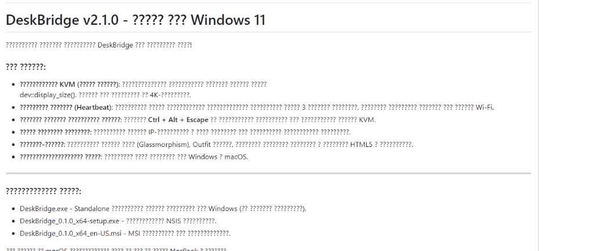
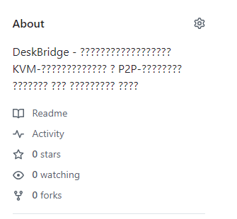

<div align="center">


# DeskBridge (v2.2.0)

**Беспроводной KVM-переключатель и P2P-обменник файлами для локальной сети**

[](https://github.com/dmitrymx/deskbridge/releases)
[](https://tauri.app)
[](https://react.dev)
[](https://www.rust-lang.org)
[](#)
[](LICENSE)

*Свяжите ваши компьютеры в единую рабочую среду. Управляйте вторым ПК одной мышкой, просто переведя курсор за край экрана, обменивайтесь файлами на гигабитных скоростях и отправляйте фото с телефона через локальный веб-портал — без серверов, без интернета, без облаков.*

---

</div>

## ✨ Возможности / Features

- 🖥️ **Виртуальный KVM (Universal Control)** — бесшовный переход мыши и клавиатуры между несколькими ПК (включая связки Windows ↔ macOS) при касании границы экрана.
- ⌨️ **Настраиваемые горячие клавиши** — переопределяйте комбинации клавиш переключения (модификаторы Ctrl, Alt, Shift + клавиши A-Z, F1-F12) в реальном времени прямо из панели настроек.
- 🚀 **Высокоскоростной P2P-обмен** — прямая передача файлов любого объема со скоростью до 1 Гбит/с и выше (ограничена только пропускной способностью вашего роутера).
- 📱 **Мобильный веб-портал** — отправляйте файлы со смартфонов iPhone/Android на ПК через браузер без необходимости устанавливать дополнительные приложения на телефон.
- 🛡️ **Контроль целостности SHA-256** — автоматический расчет контрольной суммы передаваемого файла для гарантированной защиты от сбоев при передаче.
- 📝 **Логирование в один клик** — встроенный менеджер логов в настройках с функциями копирования в буфер обмена, сохранения в текстовый файл или очистки.
- 🔌 **Выбор сетевого интерфейса** — ручной выбор активного IP-интерфейса для исключения виртуальных адаптеров (WSL, VMware, VirtualBox).
- 🔒 **100% Приватность и Offline** — программа не делает внешних запросов, не использует CDN и полностью автономна.

---

## 📸 Скриншоты / Screenshots

<div align="center">
  
  
</div>

---

## 📋 Таблица сравнения версий

| Возможность | v1.0.0 (Базовая) | v2.1.0 (Улучшенная) | v2.2.0 (Текущая стабильная) |
| :--- | :---: | :---: | :---: |
| **Локальное P2P-копирование** | ❌ (Только KVM) |  |  |
| **Веб-портал для iOS/Android** | ❌ |  |  |
| **Автоподстройка под разрешение (4K)** | ❌ |  |  |
| **Экстренный сброс (Ctrl+Alt+Esc)** | ❌ |  |  |
| **Выбор физического адаптера (IP)**| ❌ |  |  |
| **Настраиваемые KVM-хоткеи** | ❌ | ❌ (Жесткий код) |  |
| **Автономный режим (Без CDN)** | ❌ (Запросы к Google Fonts)| ❌ |  |
| **Встроенный сборщик логов (.log)**| ❌ | ❌ |  |
| **Защита от краша диалогов на Win**| ❌ | ❌ |  |

---

## 🛠 Что нового в версии v2.2.0

*   **Кастомизация KVM-клавиш**: Интегрировано окно выбора модификаторов и буквенно-функциональных клавиш во фронтенде с автоматическим обновлением биндингов в Rust-перехватчике.
*   **Диалоги на главном потоке**: Перенос RFD-диалогов (`FileDialog`) в `app_handle.run_on_main_thread`, что устранило падения приложения на Windows при выборе файлов.
*   **Потокобезопасный логгер**: Создание файла `deskbridge.log` в локальной системной директории, логирование всех ключевых этапов соединения, P2P и веб-сессий.
*   **macOS Cursor Fix**: Избавление от метода `Mouse::get_mouse_position()`, вызывавшего сброс курсора в координату `(0,0)` на macOS. Курсор позиционируется плавно по дельтам перемещения в памяти.

---

## 💻 Инструкция по сборке / Build Guide

### 📋 Предварительные требования (Prerequisites)

#### Для Windows 11:
1.  Установленный [Node.js](https://nodejs.org/) (версии 18+).
2.  Установленный Rust-компилятор (`rustup` / `cargo`).
3.  Компилятор C++ (Visual Studio Build Tools с включенным пакетом «Разработка классических приложений на C++»).

#### Для macOS:
1.  Установленный [Node.js](https://nodejs.org/) (рекомендуется через Homebrew).
2.  Установленный Rust:
    ```bash
    curl --proto '=https' --tlsv1.2 -sSf https://sh.rustup.rs | sh
    ```
3.  Компилятор Xcode Command Line Tools:
    ```bash
    xcode-select --install
    ```

---

### 🚀 Шаги сборки (Build Steps)

Запустите терминал в корневой папке проекта `antigravity_projects`:

1.  **Установка зависимостей:**
    ```bash
    npm install
    ```

2.  **Запуск dev-сервера разработчика:**
    ```bash
    npm run tauri dev
    ```

3.  **Компиляция оптимизированной сборки (Release):**
    ```bash
    npm run tauri build
    ```

#### 📦 Результат компиляции:
*   **На Windows**: Исполняемый файл `.exe` компилируется в `src-tauri/target/release/deskbridge.exe`. Установщики `.msi` и NSIS `.exe` создаются в папке `target/release/bundle/`.
*   **На macOS**: Собранное приложение `.app` и образ `.dmg` генерируются в `src-tauri/target/release/bundle/dmg/`.

---

## 🔑 Разрешения (macOS)
Поскольку приложение осуществляет глобальный захват событий ввода, на macOS требуется разрешение:
1.  Откройте **Системные настройки > Конфиденциальность и безопасность > Универсальный доступ** (Accessibility).
2.  Добавьте **DeskBridge** в белый список и включите переключатель.

---

## 👨‍💻 Разработчик / Developer

**Максимов Д.А. (dmitrymx)**
*   🌐 **Личный сайт**: [mxmvdev.ru](https://mxmvdev.ru)
*   💬 **Telegram**: [@dmitrymx](https://t.me/dmitrymx)
*   ✉️ **Email**: mail@mxmvdev.ru

---

## 📄 Лицензия / License

Проект распространяется под лицензией MIT. Подробности см. в файле [LICENSE](LICENSE).

MIT © 2026 Максимов Д.А.
